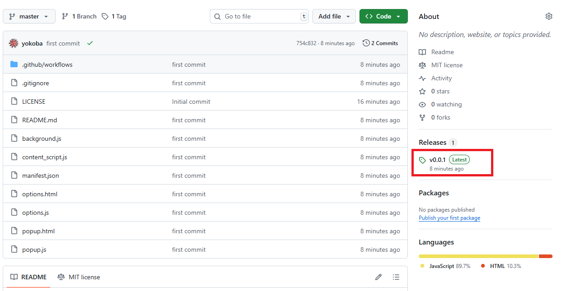
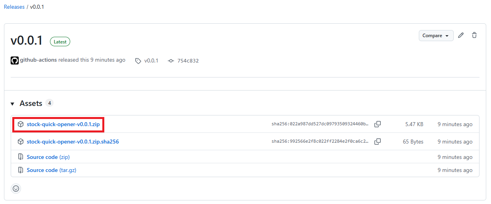
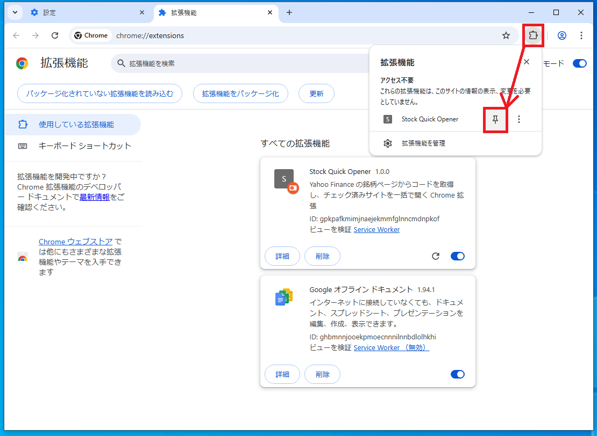
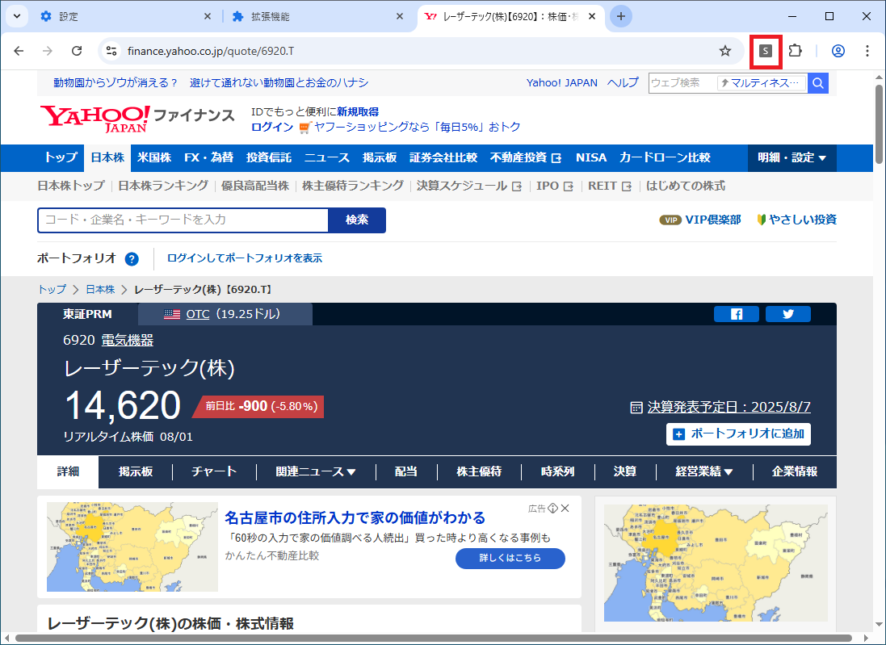
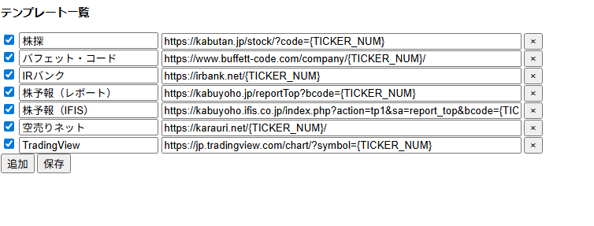

# 使い方

## 拡張機能のダウンロード

1. [Release](https://github.com/yokoba/stock-quick-opener/releases)にアクセスする。

1. Releaseから最新のzipファイルをダウンロードする。

## Chromeへ拡張機能のインストール

1. Chromeを起動して設定から拡張機能を開く

1. 右上に`デベロッパーモード`があるのでスイッチを入れる
1. ダウンロードしたzipファイルをChromeにDrag & Dropしてインストールする
1. インストールが完了すると拡張機能の一覧に表示される
1. 右上の拡張機能のボタンを押すとピンマークがあるのでクリックして有効にする
1. インストール完了

## 使い方

1. [Yahooファイナンス](https://finance.yahoo.co.jp/quote/6920.T)の好きな銘柄へ移動する。
1. 右上のSのマークをクリックすると登録されているサイトが一括で開く。
1. テンプレートの編集はオプション画面から可能です。

## オプション画面

1. Sマークを右クリックしてオプションを選択すると開くことができます。
1. デフォルトでは以下のサイトが登録されていますが、自由に変更が可能です。

### テンプレート置換ルール

オプション画面で使える置換ルールは以下となっています。

| プレースホルダ         | 内容・例                                  |
|------------------------|-------------------------------------------|
| {TICKER}               | Yahooページから抽出したティッカー（例: 6920.T, AAPL） |
| {TICKER_NUM}           | 4桁数字のみ（例: 6920）※日本株専用         |
| {TICKER_T}             | 必ず.T付き（例: 6920.T）                   |
| {NAME}                 | 会社名                                    |
| %code                  | {TICKER}と同じ                            |
| %name                  | {NAME}と同じ                              |
